### Disclaimer: This is a dummy application and only intended to demonstrate coding and programming. 

# django-express-it
Express-it is a very simple but robust and scalable application. It allows the registered users to share images.

# Objective & features:
* Express-it homepage where users can view posted images, content, register, login and logout options.
* Users can only view the limited details of each image (title and author name). To view details of the post, create post, they must need to register and login.
* Register new user, login and logout sessions. The Django authentication system is being used handles both authentication and authorization.
* @Login_required decoraters is being used to only allow logged in users to view profile and create post.
* Django messaging framework to display custom messages. Each message will disappeared after 5 seconds using javascript.
* During registraion of new user, check if username exists in real-time through Ajax without reloading the page.
* Custom navbar to stay visible on scrolldown and back to the top button to get back to the top of the page.
* Responsive design for any screensize.
* Django form validation for registration and login.
* Django debug toolbar to optimize performance during development.

# Javascript & JQuery animations and Ajax calls.
* HTML 'marquee' tag is being used to scroll banner and other section headings.
* Flashing heading boxes.
* Slide in effects on scrolldown from left to right.
* Post section fade in slowly when scrolldown the page.
* Day and Night photography sections display related contents on clicking each section without reload page. Hover and scrolldown each section and on mouseleave, it will go back to it's origin.
* Fixed footer at the bottom of the page.

# Tools:
* Django==1.10
* django-debug-toolbar==1.9.1
* MySQL-python==1.2.5
* Pillow==4.3.0
* selenium==3.10.0
* Javascript
* jquery
* Bootstrap.
* HTML & CSS

# Steps to run:
### Step 1:
Create a folder.

$ mkdir express_it

Create a virtual enviroment.

$pip install virtualenv

$ cd express_it

$ virtualenv env

$ source env/bin/activate

### Step 2:
Install requirements.txt

$pip install -r requirements.txt

### Step 3:
Edit settings.py with database credentials.

  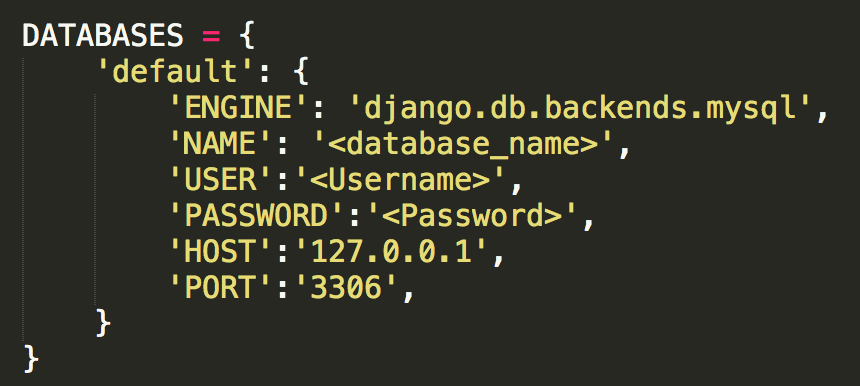

### Step 4:
Database migrations.

$ python manage.py makemigrations

$ python manage.py migrate

### Step 5:
Run project.

$ python manage.py runserver

### Folder Structure.

  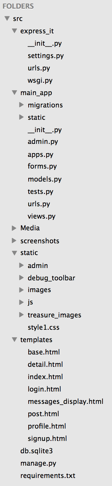

### User table in database.

  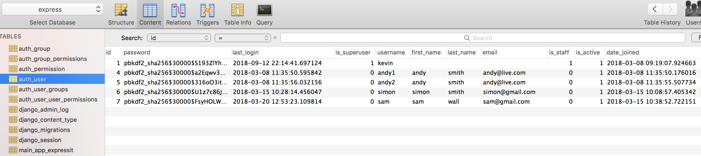

### Post table in database.

  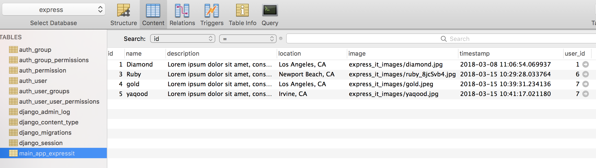

# ---------------------------- Demo -------------------------------
#### Home page
http://127.0.0.1:8000/ is a home page which displays all posts posted by the user. This page also display options to login & register. Users can only see the post image and author name. To view the whole post and comment, user must login or register. 

  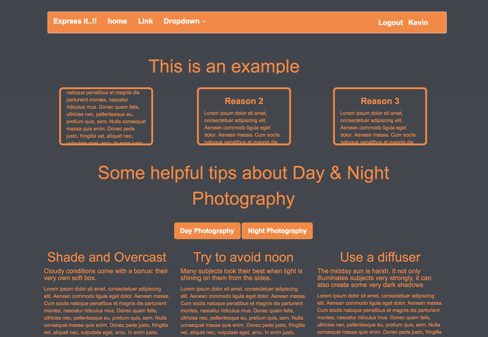

#### Responsive Navbar.
On scroll down, navbar will change its position and moves down along the page

  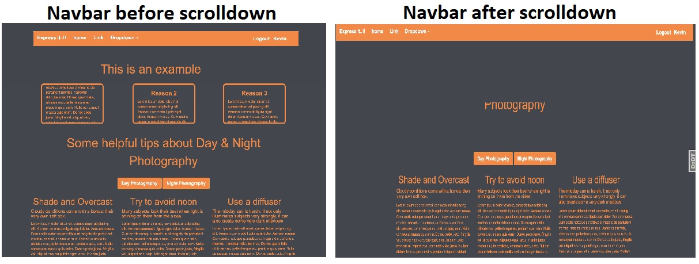

#### Login.
Django authentication framework is being used to validate the username and password and perform login, logout operations. If either of it is wrong, it will prompt a custom error message. On success, it will show a custom messages. It will also give an option to register if user is not registered yet.

  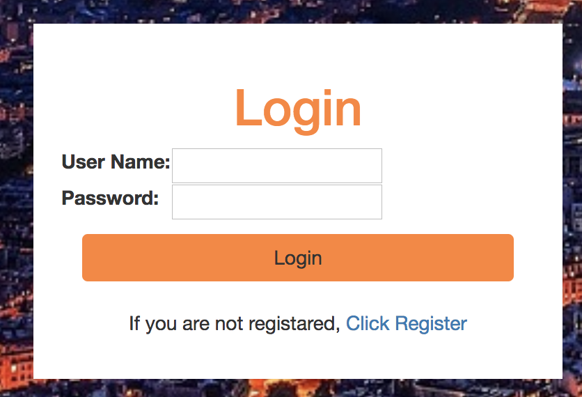

Error if username or password is not corrent.

  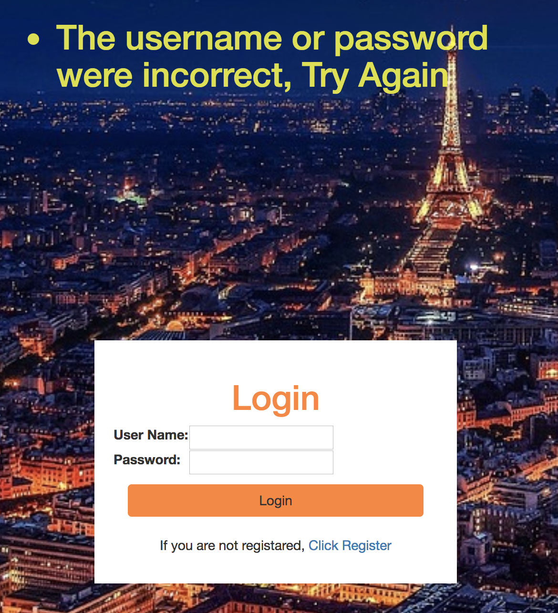

#### Register.
Register a new user and validate their credentials. If the username is already exists or password is not is correct, it will display an error messages. Form validation is been used to check whether both password fields must for the successful registration.

Error message if try to submit a blank form.

  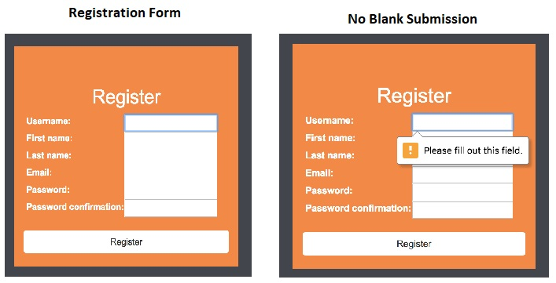

Alert message username is already taken. Erorr message if password doesn't match and username is taken.

  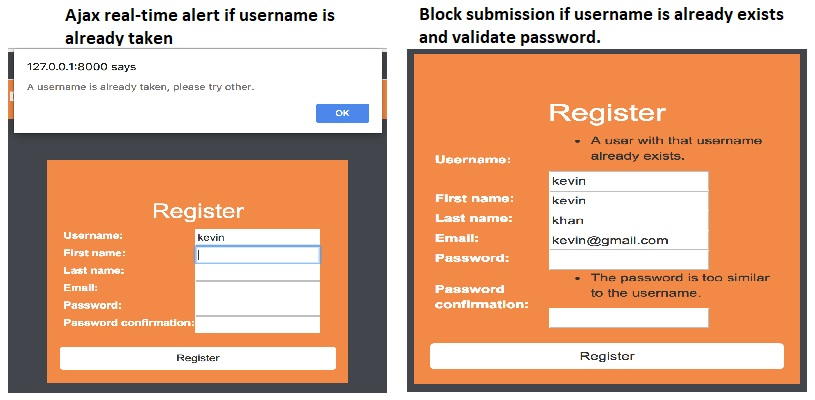

### User Profile.
User profile or dashboard shows username, user post and create new post.

  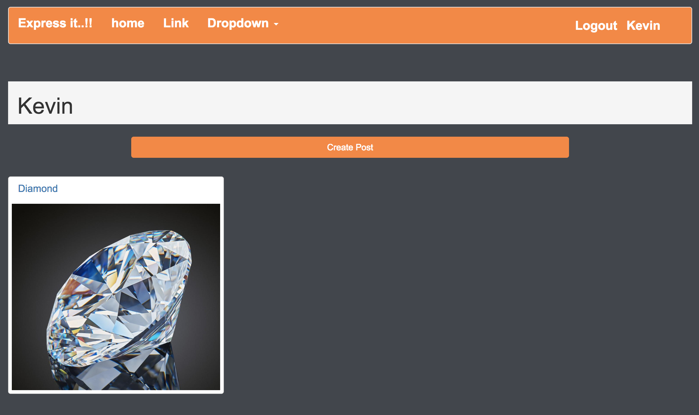

Create new post.

  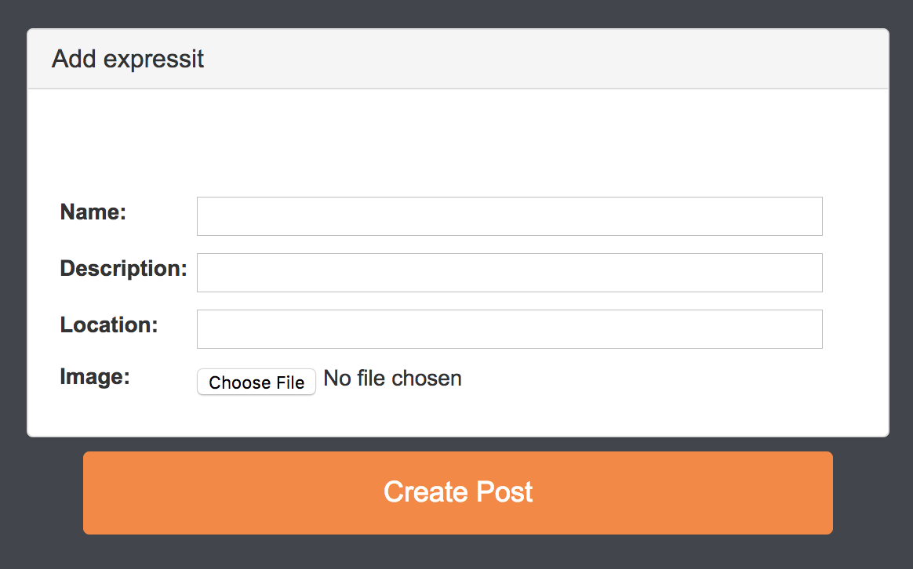

User post with post details. 

  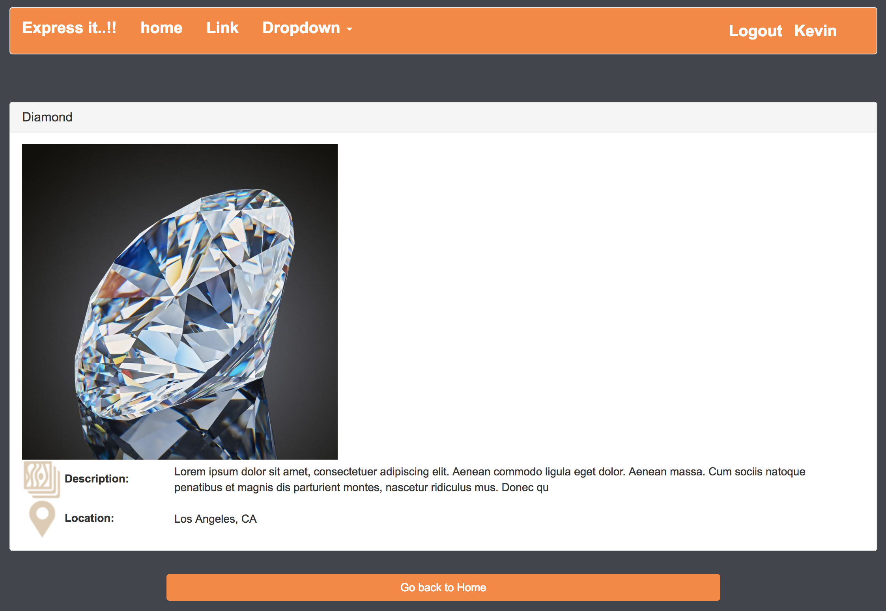

# ------------- Selenium Automated Test -----------------
Selenium is designed to automate web browser interaction, so scripts can automatically perform the same interactions that any user can perform manually. Selenium can perform any sort of automated interaction, but was originally intended and is primarily used for automated web application testing.

#### main_app --> tests.py
### Goals.
* Should click on registerlink and register New User.
* Should go to login page, fill credentials and click on login button.
* Should go to login page, click at Register link underneath of login fields "Click Register" and register New User.
* Should not allow to view User profile if user is not logged in and redirect to login page.
